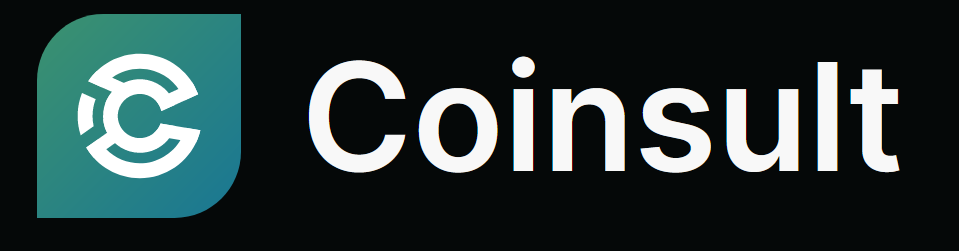

# Audit & Security

In striving for trust and reliability, security and transparency stand as foundational pillars within the Arkenstone ecosystem.&#x20;

### What is Quantstamp?

[Quantstamp ](https://certificate.quantstamp.com/full/arkenstone-arkn/4a1c41e3-726a-470e-9f8f-5dec1e145dd3/index.html)is a global leader in blockchain security. Since 2017, they secured billions in digital assets and worked with some of the most recognized names in web3.

<figure><figcaption>
Sequrity Partner Quantsamp
</figcaption></figure>

🛡Our Quantstamp Audit



### What is Coinsult?

Coinsult is a pioneer in blockchain security, utilizing best-in-class manual security checks and AI technology to secure, develop and monitor blockchains, smart contracts, and Web3 apps.

<figure><figcaption>
Sequrity Partner Coinsult
</figcaption></figure>

🛡Our Coinsult Audit



