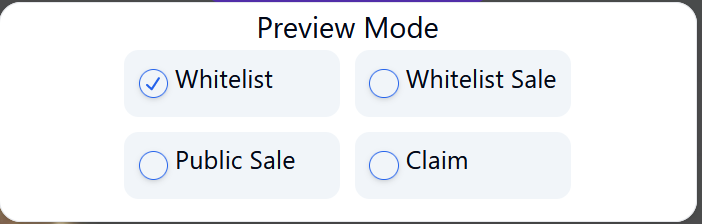

# Demo Product

You can explore the GemLaunch Suite by accessing our demo product on the Devnet. Utilizing the Devnet Solana, which holds no monetary value, allows users to experience the suite risk-free. As the suite is continuously under development, we encourage users to check back regularly for updates and new features, ensuring they stay informed and get the most out of their experience.

### 📣 IMPORTANT:  DEMO Product is running on Solana DEVNET. Devnet Solana has NO value. Further information: [Introduction to Solana Development](https://solana.com/docs/intro/dev) [How to get Solana devnet SOL (including airdrops and faucets)](https://solana.com/developers/guides/getstarted/solana-token-airdrop-and-faucets)

### VSIT [https://arkenstone.gold/suite](https://arkenstone.gold/suite/) to try the DEMO PRODUCT

Users can easily engage with the GemLaunch Suite by selecting the preview mode, enabling them to interact with the different widgets and experience its functionality firsthand. This hands-on approach empowers users to explore the suite's capabilities and understand its potential impact on their projects.

<figure><figcaption>
select preview mode
</figcaption></figure>

### Available widgets to try

**1) Whitelist Registration**

Users can register wallets on a whitelist for a Private Sale to secure their spot as a Token buyer and ensure eligibility for future airdrops. Registration details are transparent and securely stored on the blockchain.\
\
Arkenstone GemLaunch Suite enables Airdrop distribution to whitelisted users. This feature makes sure, you will reward your early investors.

**2) Private Presale**

Registered users can utilize their whitelist registration once the Private Sale opens. Whitelist users can buy at a discount rate. You can also set the duration of the Private Sale, for example 48 hours. After this time, the Private Sale close automatically or will open for Public Presale as per your choice.

**3) Public Presale**

Arkenstone GemLaunch Suite enables all users to buy in a Public Presale. Tokens can be distributed directly to users wallets or held back until claim date.

**4) Token Claim**

If you set a specific date for claiming Tokens, the sold Token will be held back until the claim date is reached. Once the specific date has been reached the users are able to claim their Tokens manually.

**5) Reward distribution**

During your different registratoins or Presale rounds, some users might qualify for additional boni as free bonus Token, NFT or other rewards. Arkenstone GemLaunch Suite has a built-in feature to automatically distribute those rewards to qualified users when they claim their Token.

**6) Monitoring**

The Management panel of Arkenstone GemLaunch Suite provides comprehensive monitoring and control features, allowing project creators to oversee Token sales, track performance metrics, and manage participant data with ease. With intuitive controls and real-time insights, it’s the backbone for efficient management and successful ICO campaigns.
