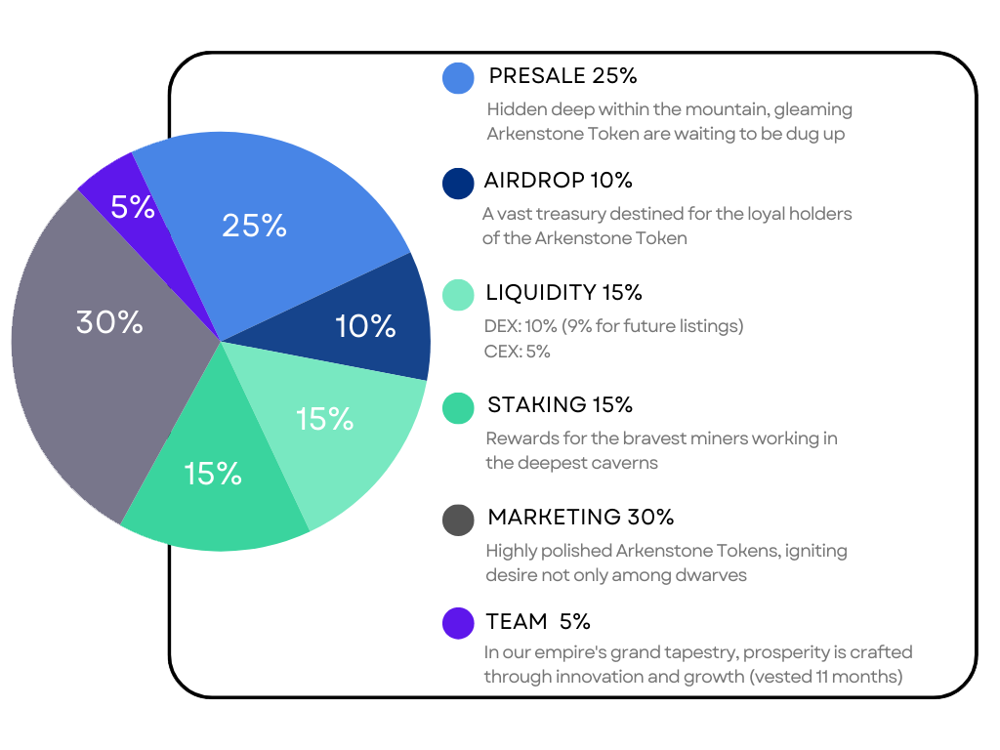

# Tokenomics

## Limited Token Supply

* **Why Limited Supply Matters**: A limited token supply helps maintain the value of a cryptocurrency. If there were an infinite supply, the token’s demand would decrease over time, reducing its value.
* **Risks of Unlimited Supply**: Cryptocurrencies with unlimited supplies can be risky investments. The founding team might set an unlimited supply for suspicious reasons, like cashing out liquidity, which can hurt investors. Fixed supply tokens are generally considered safer.

## $ARKN Token Distribution

The [Arkenstone presale](https://arkenstone.gold/) begins on May 16th, 2024, offering 1 billion $ARKN Tokens (25% of the total supply) during the private and public presale phases. Here’s how the total supply of 4 billion $ARKN Tokens is allocated:

1. **Presale**: 25% available during the private and public presale.
2. **Liquidity**: 15% reserved to ensure liquidity.
3. **Airdrops**: 10% allocated for airdrops to promote wider distribution.
4. **Staking Rewards**: 15% set aside for staking rewards to encourage holding and network security.
5. **Marketing**: 30% dedicated to marketing efforts to increase awareness and adoption.
6. **Team**: 5% vested for 11 months to align the team’s incentives with the project’s success.

For a detailed breakdown of the token allocation, check out the Arkenstone [tokenomics](https://arkenstone.gold/#tokenomics).

<figure><figcaption></figcaption></figure>
